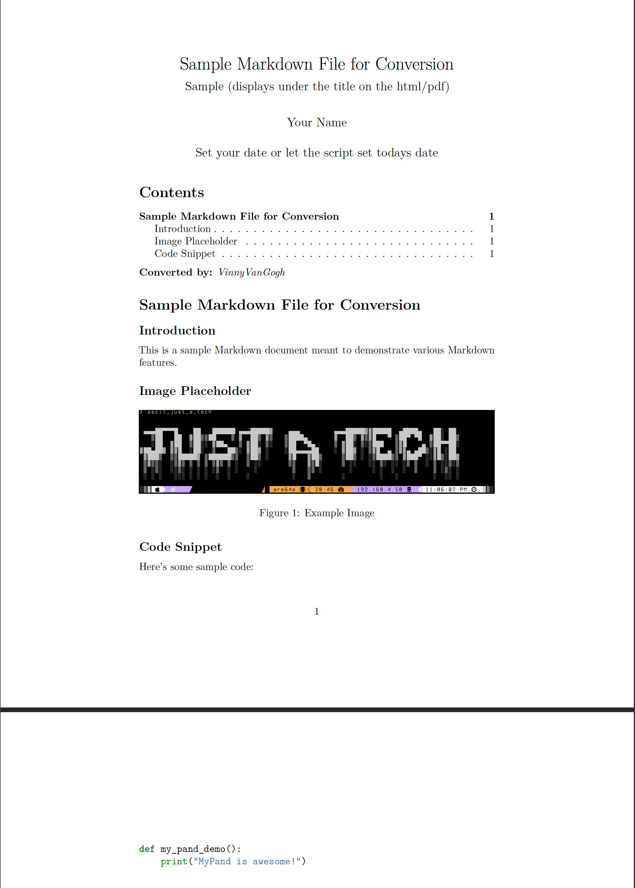

# mypand

## Table of Contents

- [Prerequisites](#prerequisites)
- [Description](#description)
- [Installation and Setup](#installation-and-setup)
- [Usage](#usage)
  - [Markdown to Base64 Encoded HTML](#markdown-to-base64-encoded-html)
  - [Markdown to Github HTML](#markdown-to-github-html)
  - [Markdown to PDF](#markdown-to-pdf)
    - [An example file before conversion:](#an-example-file-before-conversion)
- [Contributing](#contributing)
- [License](#license)

## Prerequisites

- [Python 3.8 or higher](https://www.python.org/downloads/)
- [Pandoc](https://pandoc.org/installing.html)

## Description

A pandoc wrapper for converting markdown files to html and pdf files. Adds github css, allows for b64 encoding of html, and allows for pdf conversion. Makes sharing markdown files easier.
Stay tuned for more features.

- The only requirements are Python 3.8 and Pandoc.

## Installation and Setup

1. Clone the repository

```shell
git clone https://github.com/VinnyVanGogh/mypand.git
```

2. CD into the directory

```shell
cd mypand
```

3. Run the project:
- -b for b64 encoded html, -gh for github html, and -p for pdf
  - All converted from markdown files through pandoc

```shell
python3 mypand.py "/path/to/file.md" -b/--base64, -gh/--github, or -p/--pdf
```

## Usage

**A pretty simple shell application that allows you to convert markdown files to html and pdf files.**

- There are three ways to run the project:
  - -b for b64 encoded html, -gh for github html, and -p for pdf
    - All converted from markdown files through pandoc

**After all 3 examples, you will see another image, showing how the markdown that was converted for all 3 demos looks.**


### Markdown to Base64 Encoded HTML

- Run the project, specifying base64 encoded images, and html with github darkmode css(You will not have to upload your files, the html is completely self contained):
  - you can run this with either -b or --base64

```shell
python3 mypand.py "/path/to/file.md" -b
```


### Markdown to Github HTML

- Run the project, specifying html with github darkmode css (you will have to upload your images with your html and make sure they are in the same dir structure as your markdown file):
  - you can run this with either -gh or --github

```shell
python3 mypand.py "/path/to/file.md" -gh
```


**Images WILL work, you just have to move them to the same dir, or change the path to the FULL path if you're only going to use it locally, base64 encoding is just a little more convenient for sharing.**

### Markdown to PDF

- Run the project, specifying pdf(You will not have to upload your files, the pdf is completely self contained however the output is not as clean as the html, and pandoc does some funky things with moving images around in pdfs...):
  - you can run this with either -p or --pdf

```shell
python3 mypand.py "/path/to/file.md" -p
```




#### An example file before conversion:

- This is what the markdown file looks like before conversion:


## Contributing

We welcome contributions to improve mypand. To contribute, follow these steps:

1. Fork this repository.

2. Create a branch for your changes:

```shell
git checkout -b '<branch_name>'
```

3. Make your changes and commit them: 

```shell
git commit -m 'Your commit message'
```

4. After you have committed your changes, push to the original branch:

```shell
git push origin 'branch_name'
```

5. Create a pull request on the original repository and describe your changes.

## License

This project is licensed under the [MIT License](LICENSE). You can find the full text of the license in the [LICENSE](LICENSE) file.
