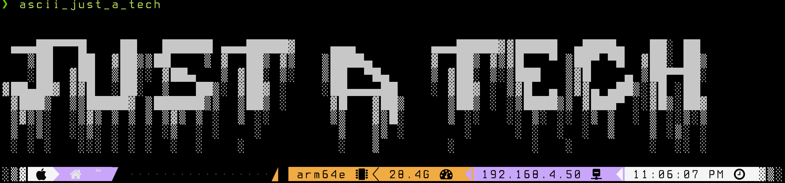

**Converted by:** _[VinnyVanGogh](https://github.com/VinnyVanGogh/mypand)_

# Title: Sample Markdown File for Conversion
# Author: Your Name
# Subtitle: Sample (displays under the title on the html/pdf)
# Date: Set your date or let the script set todays date
# Keywords: keywords, for, your, document, separated, by, commas
# Description: A description of your document, this doesn't display directly on the html/pdf, but is used for SEO

# Sample Markdown File for Conversion

## Introduction

This is a sample Markdown document meant to demonstrate various Markdown features.

## Image Placeholder



## Code Snippet

Here's some sample code:

```python
def my_pand_demo():
    print("MyPand is awesome!")
```


